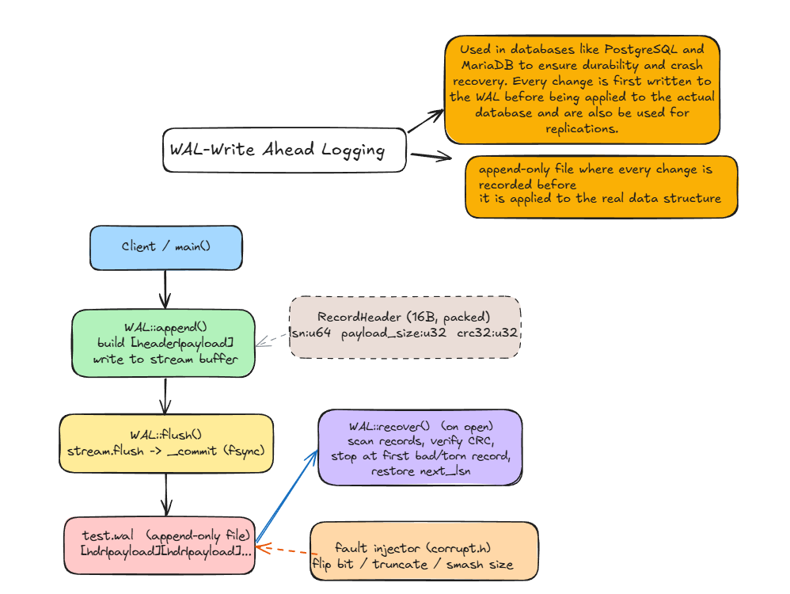

# WAL - Write-Ahead Log 

A small, educational write-ahead log written in C++. Records are appended to an
append-only file with a checksummed header, forced to disk durably, and replayed
on startup. A tiny fault injector is included to test recovery against corruption
and torn writes.


## What is a write-ahead log?

A write-ahead log is an append-only file where every change is recorded **before**
it is applied to the real data structure. The rule is: write the intent to the log
and force it to disk first, then mutate the actual state. If the process or machine
crashes, the log is replayed on restart to rebuild everything that was durably
recorded.

It gives you two things:

- **Durability**: once a record is flushed (`fsync`), it survives a crash.
- **Recovery**: on restart you replay the log up to the last valid record.

## Where it's used

WALs are the durability layer behind most storage systems:

- **Databases**: PostgreSQL (WAL), SQLite (journal/WAL), MySQL InnoDB (redo log)
- **Key-value / LSM stores**: RocksDB, LevelDB (log written before the memtable)
- **Distributed systems & filesystems**: Kafka, Raft/etcd logs, ext4/NTFS journaling

## Architecture



Editable source: [`docs/architecture.excalidraw`](docs/architecture.excalidraw), open it at
[excalidraw.com](https://excalidraw.com).

## On-disk record format

Each record is a fixed **16-byte packed header** followed by the raw payload:

| Field          | Type   | Size           |
| -------------- | ------ | -------------- |
| `lsn`          | uint64 | 8 B            |
| `payload_size` | uint32 | 4 B            |
| `crc32`        | uint32 | 4 B            |
| `payload`      | bytes  | `payload_size` |

## Build & run

Requires a C++17 compiler (tested with g++ / MinGW on Windows).

```sh
# demo
g++ -std=c++17 src/wal.cpp -o wal && ./wal

# verification tests (phases 1-3)
g++ -std=c++17 src/test_wal.cpp -o test_wal && ./test_wal
```

## Project layout

```
include/
  wal.h        WAL class + RecordHeader
  corrupt.h    fault injector (bit-flip, truncate, smash size)
src/
  wal.cpp      append / flush / recover
  crc32.cpp    CRC32 checksum
  test_wal.cpp phase 1-3 verification tests
docs/
  architecture.excalidraw
```

## Tests

- **Phase 1**: append + flush, reopen from disk, confirm exact replay (durability).
- **Phase 2**: write across multiple sessions; confirm the LSN counter continues
  across reopens instead of resetting.
- **Phase 3**: deliberately corrupt the log (bad CRC, torn tail) and confirm
  recovery stops at the last good record instead of crashing.

## Limitations

Intentionally toy-scoped. Not implemented:

- No log truncation / compaction : a detected corrupt tail is not trimmed.
- No concurrency or locking.
- No segment rotation or size limits.
- Payloads are opaque bytes; no transactions or checkpoints.
- `next_lsn` is rebuilt by scanning the whole file on open.
